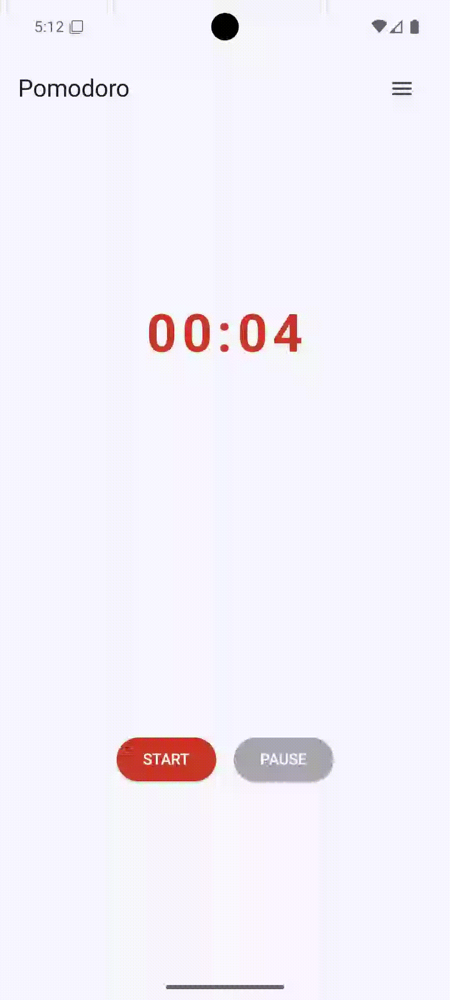
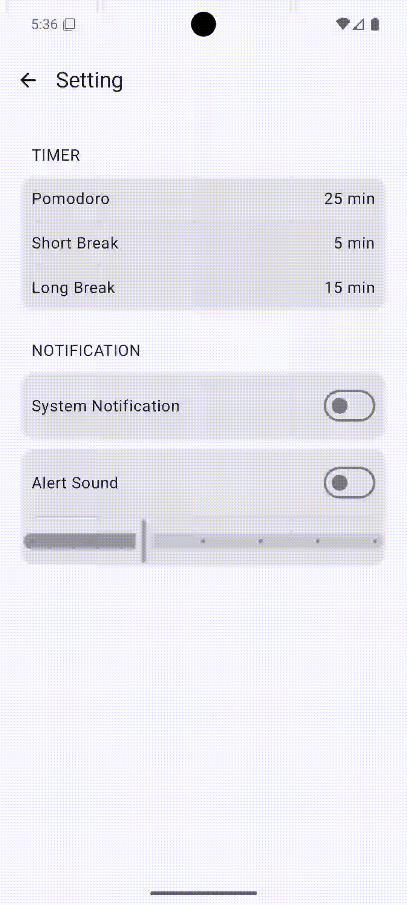
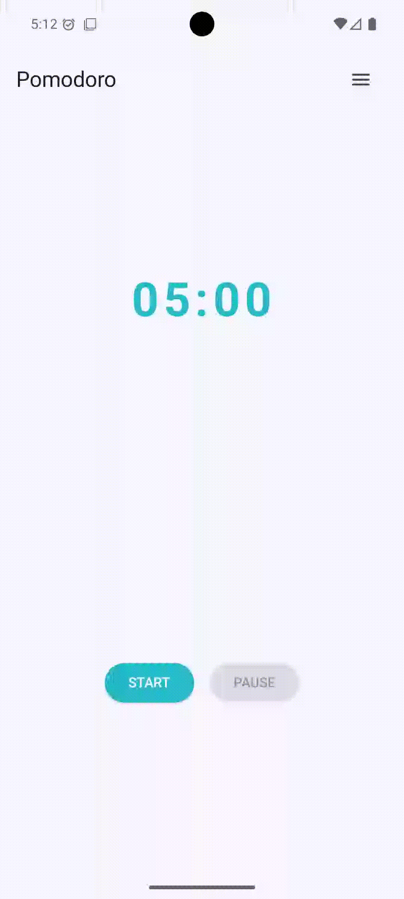
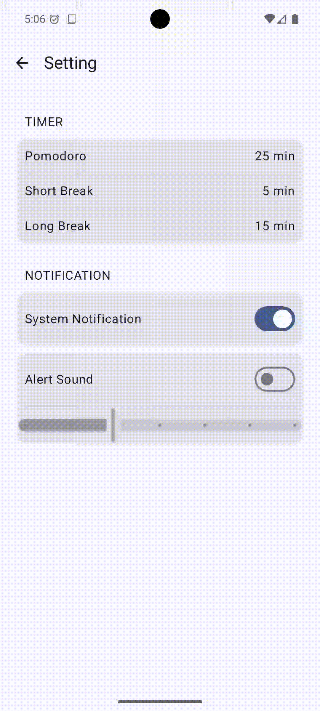
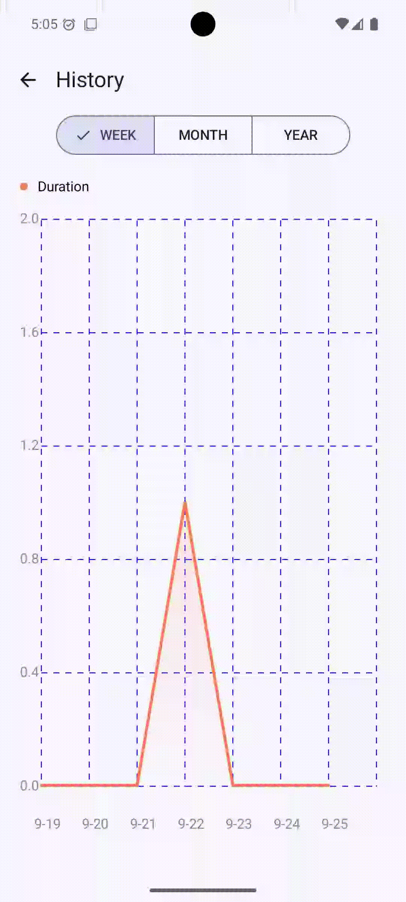

# Pomodoro Timer
This is my first Android project developed using Jetpack Compose. It's a customizable Pomodoro timer designed to improve productivity through focused work sessions.

## 📸 GIFs of the app

  
  
  

  
  

## 🛠️ Built With
- Kotlin
- Kotlin Coroutine
- Android SDK
- Jetpack Compose
- ROOM
- Prefereces DataStore
- Koin
- Navigation
- Notification Channels
- AndroidX components
- [AAY-Chart](https://github.com/TheChance101/AAY-chart?utm_source=chatgpt.com)

### 📧 prchen030@gmail.com
